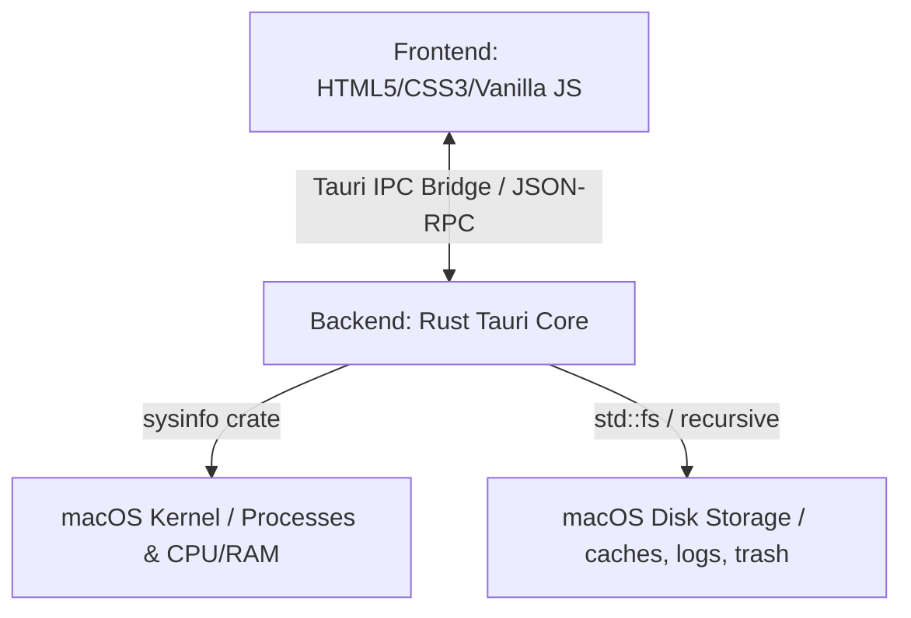

# MacClean Custom

A lightweight, high-performance utility application designed for macOS to monitor system resources, manage active processes, and perform disk space optimization. Built using the **Tauri v2** framework, it features a modern, fluid user interface rendered via WebKit, backed by a secure and blazing-fast system monitoring engine written in **Rust**.

## 📊 System Architecture



---

## 🎯 Key Features

1. **Dashboard & Resource Telemetry**:
   * Real-time radial meters for overall CPU and RAM load.
   * Total processes count and detection of inactive or zombie processes.
2. **Process Monitor**:
   * Interactive search and sorting (by PID, name, CPU, or Memory).
   * Capability to terminate resource-heavy or frozen applications.
3. **Disk Space Cleaner**:
   * Automatic scanning of safe-to-delete folders:
     * User cache folders (`~/Library/Caches`)
     * System & Application logs (`~/Library/Logs`)
     * macOS Trash Bin (`~/.Trash`)
     * Xcode DerivedData (`~/Library/Developer/Xcode/DerivedData`)
     * Homebrew cache (`~/Library/Caches/Homebrew`)
   * Selective cleanup with immediate statistics of freed storage.
4. **Large Files Finder**:
   * Recursive scanner of primary user folders (`Documents`, `Downloads`, `Desktop`) for files exceeding a selected size threshold (50MB, 100MB, 500MB, 1GB).
   * Safe and quick removal of large files directly from the UI.

---

## 🛠️ Technology Stack

* **Frontend**: Vanilla HTML5, CSS3 (sleek dark mode design, custom macOS system styling), and JavaScript.
* **Backend**: Rust (Tauri v2), leveraging the `sysinfo` library for lightweight and fast kernel data retrieval.
* **Communication**: Secure asynchronous Inter-Process Communication (IPC) via Tauri commands.

---

## 🚀 Execution & Build Guide

### Prerequisites

Ensure you have the following installed on your Mac:
* **Rust & Cargo** (via `curl --proto '=https' --tlsv1.2 -sSf https://sh.rustup.rs | sh`)
* **Node.js** (for manager packages installation)
* Xcode Command Line Tools (`xcode-select --install`)

### Local Setup & Development

1. **Install Node.js dependencies**:
   ```bash
   npm install
   ```
2. **Run the application in hot-reload development mode**:
   ```bash
   npm run tauri dev
   ```

### Production Build

To compile a highly optimized, production macOS app package (`.app` and `.dmg`):

```bash
npm run tauri build
```

The resulting bundle will be available in `src-tauri/target/release/bundle/`.
